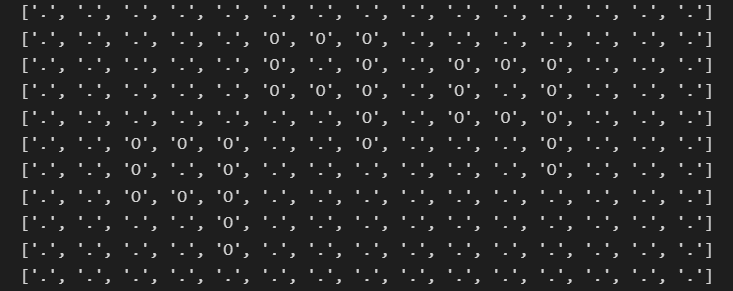
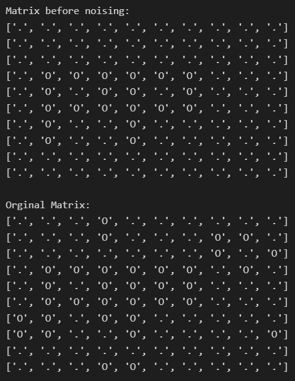

# Letter-Pattern-Generator-and-Detector
:mega: In this repository I will show you my pattern model. Let's explain some parts of code. Note that, this model only works with 'P' and 'q' letter.

Suppose that we have matrix like that:

In this matrix, we want to find the count of letter 'q' and its starting coordinate.
As we have 'noiseMatrix' function (I explained it below) the matrix won't be clean like that.

Sometimes the noising can hide letter, just like that: 

## :books: Required libraries
- randint: to generate letters at random places.
- deepcopy: to save clean version of matrix before noising.
- clear_output: to clear output of generator to get rid of complexity.

## :hammer: Generator
It generates matrix which includes letters inside it.

- createLetter: this function creates letters by changing patters at specified position. 
- check: this function checks positions to prevent overlapping. For example: (0, 0) and (1, 1) can't be coordinates of letters on same matrix.
- coordinateGenerator: it generates random coordinates for letters with the help of random library. It also checks if coordinate usable or not (with the 'check' function).
- noiseMatrix: it spoils clean version of matrix. We want model to find letters even if matrix isn't clean. So, we have to mess matrix a little bit :)
- generate: it contains relations with other funcions. If we want to change symbols of letter and non-letter patterns, we can change it from here.

Then at 34th cell I generated a matrix to test if functions are working.

## :mag: Detector
Detector finds coordinates of letters placed in matrix.

- printMatrix: it simply prints matrices.
- equalityCheck: it checks if letter matrix is same as submatrix.
- find: firstly it creates letter matrices, then it will compare this matrix with submatrices of pattern matrix.

At 5th cell all the model running. After generating every matrices model asks if we want to continue with that matrix. Generator has some bugs, so it will generate wrong matrices. If we want it to generate again we call write 'n'.

## :hourglass_flowing_sand: GAN model
I wrote this part of model based on Generative Adversarial Network's working principle. The generator creates matrix based on our parameters and then 'find' funtions tries to detect letters. If 'find' can detect the values as we want, then we can use this matrix. 

- findGAN: this function is same as 'find' function but it doesn't print any matrices, simply returns coordinates.
- processGAN: generating and counting happens here.
- ganModel: main principle comes from here. It will repeat processes until model generates the required matrix. Every time the process repeating it will print 'Generating...'.
- runModel: this function packs all the required applications.
